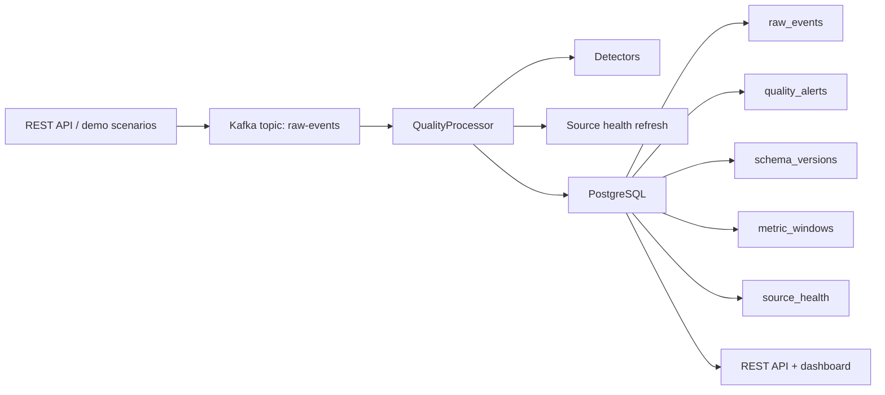

# DriftWatch Tower

[CI workflow](https://github.com/JeremyL691/DriftWatch-Tower/actions/workflows/ci.yml) · MIT License

DriftWatch Tower is a personal backend project I built to practice something a lot closer to a real internal data platform than a standard CRUD app.

I wanted to make a Java/Spring Boot system that could ingest streaming events, watch for quality problems in near real time, keep evidence in PostgreSQL, and surface everything in a simple dashboard that is easy to demo.

## Why I Built This

Most portfolio projects stop at authentication, dashboards, and database forms. I wanted one project in my GitHub that felt more like infrastructure:

- Kafka-based event ingestion
- schema drift detection
- duplicate and late-event detection
- window-based anomaly checks
- source health scoring
- database-backed alert evidence
- integration tests and CI

This project was also a way for me to show that I can move beyond Python-heavy AI/data work and build backend systems in Java with stronger engineering structure.

## What It Does

At a high level, the app accepts `DataEvent` payloads, publishes them to Kafka, processes them through a quality pipeline, stores the results in PostgreSQL, and exposes the output through REST APIs plus a lightweight dashboard.

Implemented detectors:

| Detector | Purpose |
|---|---|
| `DuplicateDetector` | flags repeated `event_id` values or repeated payloads |
| `LateEventDetector` | catches events that arrive too far after their original timestamp |
| `SchemaDriftDetector` | compares incoming payload shape against the active schema baseline |
| `NullSpikeDetector` | watches for sudden jumps in null or missing field rates |
| `AnomalySpikeDetector` | detects abnormal event-count bursts in metric windows |
| `STALE_SOURCE` / source health | marks sources that have gone quiet or unhealthy |

## Architecture



## Project Highlights

- End-to-end event flow from API -> Kafka -> detector pipeline -> PostgreSQL
- Schema version tracking with drift evidence
- Windowed metrics for null spikes and anomaly spikes
- Source health snapshots with stale-source alerts
- Browser dashboard for demos and quick inspection
- Testcontainers-based integration testing
- GitHub Actions CI

## Dashboard

The dashboard is meant to make the project easier to understand quickly, especially for recruiters or engineers skimming the repo.

Routes:

- `/dashboard`
- `/dashboard/api/summary`
- `/alerts`
- `/sources/health`
- `/schemas`
- `/metrics/windows`

## Demo Scenarios

I added deterministic demo scenarios so the system is easier to show without manually crafting every event:

- `normal-flow`
- `schema-drift`
- `duplicate-events`
- `late-events`
- `null-spike`
- `anomaly-spike`
- `stale-source`
- `mixed-incident`

Example:

```bash
curl -X POST http://localhost:8080/demo/run-scenario/schema-drift
```

## Running It Locally

### Option 1: run services locally

Requirements:

- Java 21+
- PostgreSQL 16
- Kafka

Start the app:

```bash
./mvnw spring-boot:run
```

Check health:

```bash
curl http://localhost:8080/actuator/health
```

Open the dashboard:

```bash
open http://localhost:8080/dashboard
```

### Option 2: use Docker Compose

Start infra only:

```bash
docker compose up -d
./mvnw spring-boot:run
```

Or run the whole stack:

```bash
docker compose --profile app up -d --build
```

## Sample Event

```json
{
  "event_id": "evt-001",
  "source": "binance",
  "event_type": "market_tick",
  "event_timestamp": "2026-05-25T08:30:00Z",
  "payload": {
    "symbol": "BTC/USDT",
    "bid": 108000.1,
    "ask": 108002.4
  }
}
```

Sample files:

- [`samples/events/market_tick.json`](samples/events/market_tick.json)
- [`samples/events/schema_drift_baseline.json`](samples/events/schema_drift_baseline.json)
- [`samples/events/schema_drift_changed.json`](samples/events/schema_drift_changed.json)
- [`samples/events/late_event.json`](samples/events/late_event.json)

## Useful Endpoints

```bash
curl -X POST http://localhost:8080/events \
  -H 'Content-Type: application/json' \
  -d @samples/events/market_tick.json
```

```bash
curl 'http://localhost:8080/events/recent?size=10'
curl 'http://localhost:8080/alerts?size=10'
curl 'http://localhost:8080/schemas'
curl 'http://localhost:8080/metrics/windows?eventType=demo_null_event'
curl 'http://localhost:8080/sources/health'
```

## Testing

Run the test suite:

```bash
./mvnw test
```

The project includes:

- unit tests for detector and utility logic
- Testcontainers-backed integration tests
- GitHub Actions CI

On machines without Docker, the container-backed integration tests are skipped while the rest of the suite still runs.

## Tech Stack

- Java 21
- Spring Boot 3.3
- Spring Web
- Spring Data JPA
- Spring Kafka
- PostgreSQL
- Flyway
- Testcontainers
- JUnit 5
- GitHub Actions

## Repository Layout

```text
src/main/java/com/driftwatch/
  api/          REST controllers
  dashboard/    dashboard page + summary endpoints
  demo/         repeatable demo scenarios
  event/        event contract, producer, consumer, hashing
  persistence/  JPA entities + repositories
  quality/      detectors and processing pipeline
  source/       source health scoring and freshness logic
```

## What I Learned

This project taught me a lot about designing around event flow instead of request/response flow. The most interesting parts for me were:

- deciding how to persist quality evidence cleanly
- keeping demo scenarios deterministic enough to be recruiter-friendly
- testing Kafka/PostgreSQL behavior without depending on local setup
- thinking about failure cases like stale sources, ordering, and repeatable detector runs

## Notes

- Sample incident write-up: [`docs/sample-incident-report.md`](docs/sample-incident-report.md)
- Full build plan / development guide: [`docs/DriftWatch_Tower_Project_Guide.md`](docs/DriftWatch_Tower_Project_Guide.md)

## License

This project is available under the [MIT License](LICENSE).
