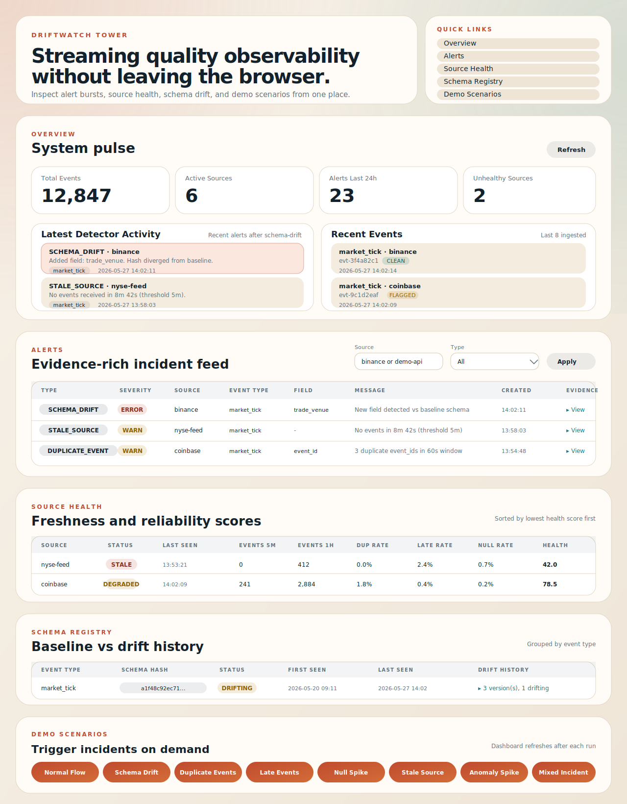
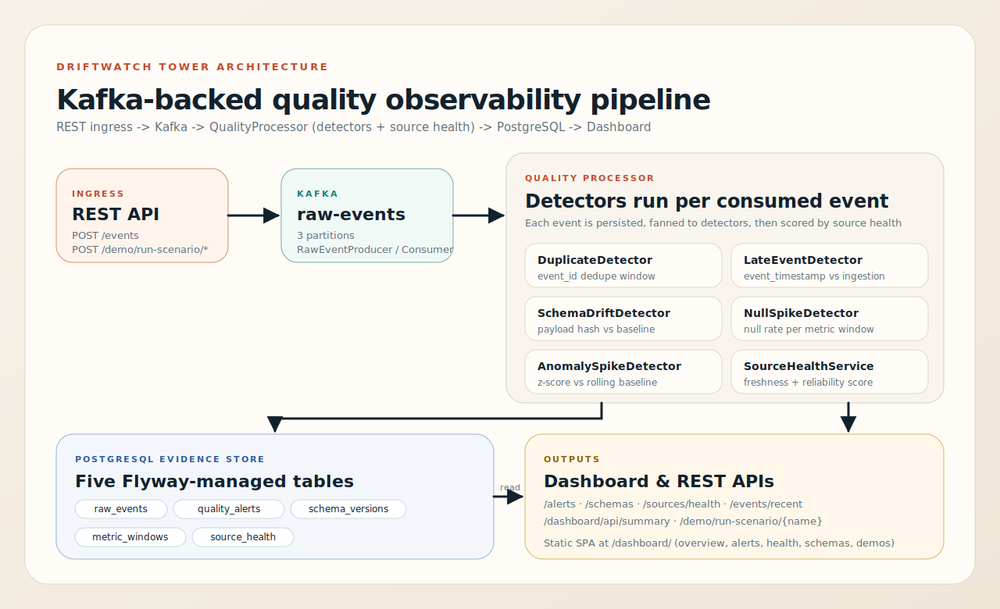
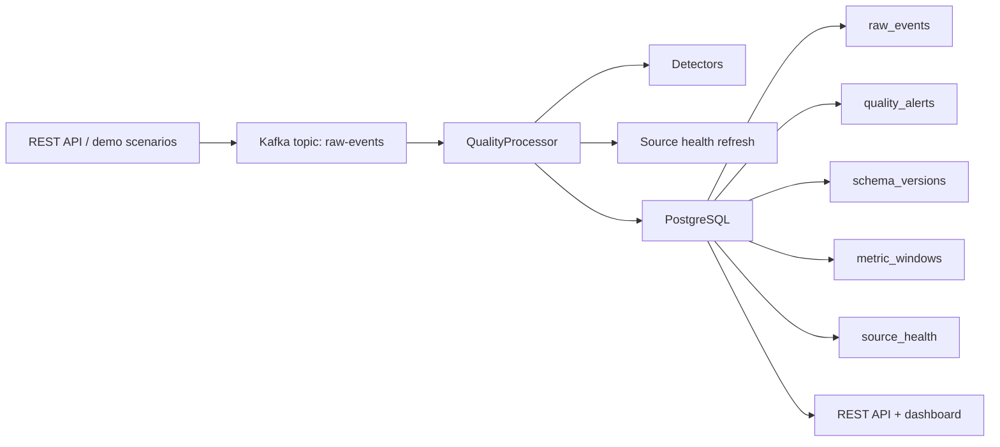

# DriftWatch Tower

> A Java/Spring Boot data-quality observability platform — Kafka ingestion, drift detection, and alert evidence for streaming events.

[](https://github.com/JeremyL691/DriftWatch-Tower/actions/workflows/ci.yml)


<p align="center">
  
</p>

DriftWatch Tower ingests `DataEvent` payloads through Kafka, runs them through a pipeline of data-quality detectors, stores evidence in PostgreSQL, and surfaces everything through REST APIs and a lightweight dashboard. It's a personal project built to look and behave more like internal data-platform tooling than a typical CRUD app.

**Status:** actively developed · single-node demo build · not intended for production.

---

## Quick Demo

Bring up the full stack and trigger a mixed-incident scenario in under a minute:

```bash
docker compose --profile app up -d --build
curl -X POST http://localhost:8080/demo/run-scenario/mixed-incident
open http://localhost:8080/dashboard
```

The dashboard shows recent events, fired alerts, schema versions, metric windows, and source health snapshots side-by-side.

---

## Why I Built This

I wanted one project in my portfolio that felt closer to internal data-platform infrastructure than another CRUD app — something with streaming ingestion, quality checks, and operational evidence that you'd actually demo to an on-call engineer.

The goal was to complement my Python data-engineering background with a stronger backend-engineering surface: Kafka, Spring Boot, JPA, Testcontainers, and CI.

## What It Does

At a high level, the app accepts `DataEvent` payloads on a REST endpoint, publishes them to Kafka, processes them through a quality pipeline, persists results in PostgreSQL, and exposes the output through REST APIs plus a Thymeleaf-free static dashboard.

### Detectors

| Detector | What it catches | Try it with |
|---|---|---|
| `DuplicateDetector` | repeated `event_id` values or repeated payload hashes | `POST /demo/run-scenario/duplicate-events` |
| `LateEventDetector` | events that arrive too far after their original timestamp | `POST /demo/run-scenario/late-events` · [`samples/events/late_event.json`](samples/events/late_event.json) |
| `SchemaDriftDetector` | payload shape that diverges from the active schema baseline | `POST /demo/run-scenario/schema-drift` · [`samples/events/schema_drift_changed.json`](samples/events/schema_drift_changed.json) |
| `NullSpikeDetector` | sudden jumps in null or missing field rates within a window | `POST /demo/run-scenario/null-spike` |
| `AnomalySpikeDetector` | abnormal event-count bursts in metric windows | `POST /demo/run-scenario/anomaly-spike` |
| Source health / `STALE_SOURCE` | sources that go quiet or become unhealthy | `POST /demo/run-scenario/stale-source` |

## Architecture

<p align="center">
  
</p>

<details>
<summary>Mermaid source</summary>



</details>

## Project Highlights

- End-to-end event flow from API → Kafka → detector pipeline → PostgreSQL
- Schema version tracking with drift evidence stored alongside alerts
- Windowed metrics for null spikes and anomaly spikes
- Source health snapshots with stale-source detection
- Browser dashboard for demos and quick inspection
- Testcontainers-based integration tests for Kafka + Postgres
- GitHub Actions CI

## Dashboard

The dashboard is meant to make the project understandable in 30 seconds for someone skimming the repo. It pulls from `/dashboard/api/summary` and renders panels for:

- recent events and their quality status
- fired alerts with detector type and evidence
- registered schema versions and the active baseline
- metric windows powering the spike detectors
- per-source health and freshness

Direct REST views are also available at `/alerts`, `/sources/health`, `/schemas`, and `/metrics/windows`.

## Demo Scenarios

Deterministic scenarios make the system easy to demo without crafting events by hand:

| Scenario | Triggers |
|---|---|
| `normal-flow` | clean baseline traffic |
| `schema-drift` | `SchemaDriftDetector` |
| `duplicate-events` | `DuplicateDetector` |
| `late-events` | `LateEventDetector` |
| `null-spike` | `NullSpikeDetector` |
| `anomaly-spike` | `AnomalySpikeDetector` |
| `stale-source` | source-health stale alert |
| `mixed-incident` | several detectors at once (recommended demo) |

```bash
curl -X POST http://localhost:8080/demo/run-scenario/schema-drift
```

## Running It Locally

### Option 1 — Docker Compose (recommended)

Run the whole stack (Postgres + Kafka + app):

```bash
docker compose --profile app up -d --build
```

Or start only the infra and run the app from your IDE / Maven:

```bash
docker compose up -d
./mvnw spring-boot:run
```

### Option 2 — Run services locally

Requirements: Java 21+, PostgreSQL 16, Kafka.

```bash
./mvnw spring-boot:run
curl http://localhost:8080/actuator/health
open http://localhost:8080/dashboard
```

## Sample Event

```json
{
  "event_id": "evt-001",
  "source": "binance",
  "event_type": "market_tick",
  "event_timestamp": "2026-05-25T08:30:00Z",
  "payload": {
    "symbol": "BTC/USDT",
    "bid": 108000.1,
    "ask": 108002.4
  }
}
```

More samples live under [`samples/events/`](samples/events/) — see [`samples/events/README.md`](samples/events/README.md) for what each one triggers.

## Useful Endpoints

```bash
# Ingest one event
curl -X POST http://localhost:8080/events \
  -H 'Content-Type: application/json' \
  -d @samples/events/market_tick.json

# Inspect state
curl 'http://localhost:8080/events/recent?size=10'
curl 'http://localhost:8080/alerts?size=10'
curl 'http://localhost:8080/schemas'
curl 'http://localhost:8080/metrics/windows?eventType=demo_null_event'
curl 'http://localhost:8080/sources/health'
```

## Testing

```bash
./mvnw test
```

The suite includes:

- unit tests for detectors, hashing, and window math
- Testcontainers-backed integration tests for the Kafka → Postgres path
- GitHub Actions CI on every push and PR

On machines without Docker, the container-backed integration tests are skipped while the rest of the suite still runs.

## Tech Stack

**Runtime:** Java 21 · Spring Boot 3.3 · Spring Web · Spring Kafka · Spring Data JPA
**Data:** PostgreSQL 16 · Flyway · Apache Kafka
**Testing & Ops:** JUnit 5 · Testcontainers · GitHub Actions · Docker Compose

## Repository Layout

```text
src/main/java/com/driftwatch/
  api/          REST controllers
  dashboard/    dashboard page + summary endpoints
  demo/         repeatable demo scenarios
  event/        event contract, producer, consumer, hashing
  persistence/  JPA entities + repositories
  quality/      detectors and processing pipeline
  source/       source health scoring and freshness logic
```

## Engineering Trade-offs

A few decisions worth flagging for anyone reading the code:

- **Alerts in a dedicated table, not a flag on `raw_events`.** Keeps raw ingestion append-only and lets a single event carry multiple, independent pieces of quality evidence over its lifetime.
- **Detectors run synchronously inside the Kafka consumer.** Simpler reasoning and ordering at the cost of throughput — fine for a demo, would be the first thing to revisit at scale.
- **Schema baselines stored as versioned rows.** Drift detection compares against the active version rather than the latest, so a known-bad payload can be quarantined without rewriting history.
- **Testcontainers shared across the test session** rather than per-test, so the full integration suite stays under a reasonable wall-clock without sacrificing isolation between detectors.
- **Source health is recomputed on each consumed event for that source**, not on a periodic sweep — keeps the staleness signal honest without a separate scheduler.

## Further Reading

- [`docs/sample-incident-report.md`](docs/sample-incident-report.md) — sample incident write-up showing how alerts and evidence connect
- [`docs/DriftWatch_Tower_Project_Guide.md`](docs/DriftWatch_Tower_Project_Guide.md) — full build plan / development guide

## License

[MIT](LICENSE)
