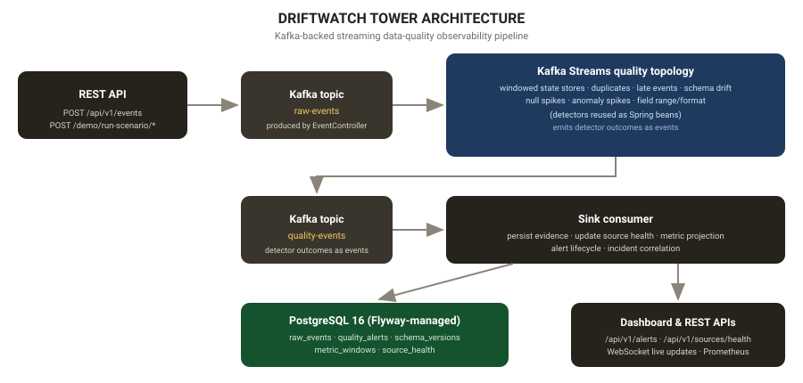
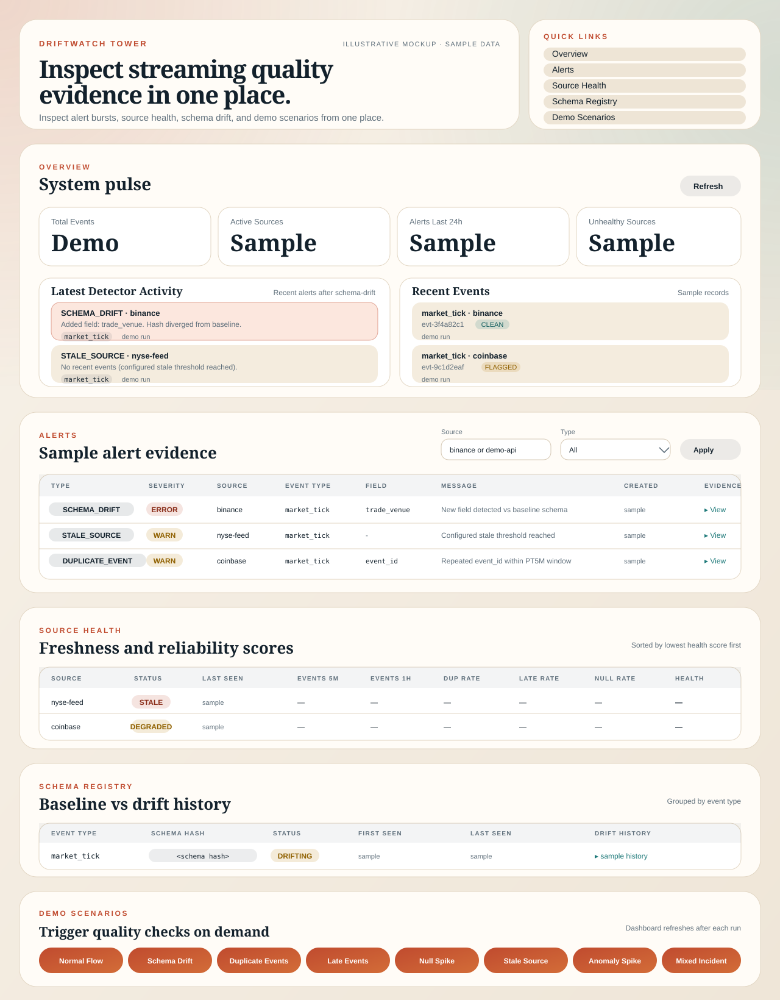

# DriftWatch Tower

> A single-node streaming data-quality service built with Java 21, Spring Boot, Kafka Streams, and PostgreSQL.

[](https://github.com/JeremyL691/DriftWatch-Tower/actions/workflows/ci.yml)
[](https://openjdk.org/projects/jdk/21/)
[](https://spring.io/projects/spring-boot)
[](LICENSE)

<p align="center">
  
</p>

A REST endpoint publishes `DataEvent` records to Kafka. A Kafka Streams topology checks each event for duplicate IDs and payloads, late arrival, schema changes, field-rule violations, null-rate spikes, and traffic spikes. The sink stores raw events and alert evidence in PostgreSQL, updates source-health snapshots, exposes Prometheus counters, and pushes new records to the dashboard over WebSocket.

Current scope: a local, single-node demo. It is not designed for multi-instance production use.

**Tech:** Java 21, Spring Boot 3.3, Kafka Streams, PostgreSQL 16, Flyway, Testcontainers, Micrometer/Prometheus, Docker Compose

## Quick start

Requirements: Docker with Compose.

```bash
docker compose --profile app up -d --build
curl --retry 30 --retry-connrefused --retry-delay 2 -fsS \
  http://localhost:8080/actuator/health
curl -X POST \
  http://localhost:8080/api/v1/demo/run-scenario/mixed-incident
```

Open [http://localhost:8080/dashboard](http://localhost:8080/dashboard) to inspect the generated events, alerts, schema versions, and source-health rows.

To run only PostgreSQL and Kafka, then start the app from Maven:

```bash
docker compose up -d
./mvnw spring-boot:run
```

## What happens to one event

1. `POST /api/v1/events` validates the event contract and publishes it to `raw-events` with a `source|eventType` key.
2. The topology adds a canonical SHA-256 payload hash. Duplicate windows use `receivedAt`; null-rate and event-count windows use the event timestamp.
3. Stateless field checks and DB-backed schema comparison run alongside persistent Kafka Streams stores for duplicate, null-rate, and event-count checks.
4. The topology emits a `ProcessedEvent` to `quality-events`.
5. `QualityEventSink` writes the raw event and structured alert evidence to PostgreSQL, projects metric windows, refreshes source health, increments Micrometer counters, and broadcasts dashboard updates.

The Flyway migrations create tables for raw events, alerts, schema versions, metric windows, and source health, then add lifecycle columns to `quality_alerts`. Raw payloads and detector evidence use PostgreSQL `JSONB` columns.

## Implemented checks

| Check | State and evidence | Demo scenario |
|---|---|---|
| Duplicate event | Persistent processing-time window stores track repeated `event_id` values and payload hashes using `receivedAt`. | `duplicate-events` |
| Late event | Compares `receivedAt` with the event timestamp and records lateness plus the configured threshold. | `late-events` |
| Schema drift | Compares the inferred payload shape with the active version and stores missing, added, and type-changed fields. | `schema-drift` |
| Null spike | Tracks missing/null fields per source, event type, and field inside an event-time window. | `null-spike` |
| Anomaly spike | Compares the current event-count window with completed baseline windows. | `anomaly-spike` |
| Field range | Applies configured numeric minimum and maximum bounds. | `field-range` |
| Field format | Applies configured regular expressions to string fields. | `field-format` |
| Stale source | Recomputes source freshness and emits an alert when a known source changes into the stale state. | `stale-source` |

Run any scenario with:

```bash
curl -X POST \
  http://localhost:8080/api/v1/demo/run-scenario/schema-drift
```

Sample request payloads are under [`samples/events/`](samples/events/).

## Alert evidence

Detectors return structured evidence instead of only a message string. This representative duplicate-payload shape mirrors the fields written by `DuplicateProcessor`:

```json
{
  "alert_type": "DUPLICATE_EVENT",
  "severity": "INFO",
  "evidence": {
    "duplicate_kind": "REPEATED_PAYLOAD",
    "payload_hash": "<sha256>",
    "window": "PT5M",
    "current_event_id": "evt-002",
    "first_event_id": "evt-001"
  }
}
```

Schema-drift evidence also includes the active and observed schema hashes, both schema documents, and explicit missing/added/type-changed fields. See the [`SchemaDriftDetector`](src/main/java/com/driftwatch/quality/SchemaDriftDetector.java) and the [illustrative triage note](docs/sample-incident-report.md).

## Dashboard and APIs

The application exposes these endpoints for direct inspection. The dashboard consumes the event, alert, schema, health, and summary views.

```text
GET  /api/v1/events/recent
GET  /api/v1/alerts
GET  /api/v1/schemas
GET  /api/v1/metrics/windows
GET  /api/v1/sources/health
GET  /actuator/prometheus
```

Alerts can be acknowledged and resolved through:

```text
POST /api/v1/alerts/{id}/acknowledge
POST /api/v1/alerts/{id}/resolve
```

<p align="center">
  
</p>

*Illustrative UI mockup. Labels and values show sample demo records, not measured production traffic.*

## Tests

```bash
./mvnw test
```

The suite includes detector and topology tests plus Testcontainers-backed checks for the Kafka-to-PostgreSQL path. When Docker is not available, JUnit skips the container-backed cases; GitHub Actions runs the full suite on pushes to `main` and on pull requests.

Useful test entry points:

- [`QualityStreamsTopologyTest`](src/test/java/com/driftwatch/stream/QualityStreamsTopologyTest.java) exercises state stores without a broker.
- [`KafkaIngestionIntegrationTest`](src/test/java/com/driftwatch/event/KafkaIngestionIntegrationTest.java) verifies REST -> Kafka -> PostgreSQL.
- [`SchemaDriftScenarioIntegrationTest`](src/test/java/com/driftwatch/demo/SchemaDriftScenarioIntegrationTest.java) verifies stored drift evidence.
- [`SourceHealthServiceTest`](src/test/java/com/driftwatch/source/SourceHealthServiceTest.java) covers freshness and the healthy-to-stale transition.

## Design notes and current limits

- Duplicate event-ID and payload-hash stores are queried without repartitioning. Detection is therefore partition-local, even in one process when `raw-events` has multiple partitions; repeated values that arrive under different `source|eventType` keys can be missed. Null-spike and anomaly-spike scopes remain aligned with the input key.
- Kafka consumer offsets and PostgreSQL writes are not committed atomically. The topology uses Kafka Streams' default at-least-once guarantee, so a replay can duplicate raw rows, alerts, or metric increments; `event_id` is indexed but not unique.
- The repository does not define authentication, an application-specific retry/backoff policy, or a dead-letter topic for failed sink writes.
- Late and out-of-order events are flagged but still update null-rate and event-count state. There is no grace period, future-timestamp guard, or quarantine path, and the null-rate processor keeps only one active window per field.
- Schema baselines are stored as versioned rows. The first observed shape becomes active; later shapes are recorded as drifting until the baseline is changed outside the current demo workflow.
- Schema observation reads and writes PostgreSQL from the topology thread, outside the Kafka Streams transaction. The demo does not handle competing first observations across partitions.
- Source health scans all known sources after each consumed event and again on health reads. If all traffic stops and nobody reads the health API, no scheduled task creates a stale alert.
- The ingestion endpoint returns after starting the asynchronous Kafka send; it does not wait for broker acknowledgement. Observability is limited to success counters and does not include consumer lag or sink-failure metrics.
- Incident tables and read APIs are scaffolded, but automatic alert grouping is not connected to the sink.
- The dashboard is a local inspection tool, not a hosted monitoring service.

I built this to practice event-time state, evidence persistence, and Kafka/PostgreSQL integration testing in Java after mostly working on Python batch pipelines.

## Repository map

```text
src/main/java/com/driftwatch/
  api/          ingestion and read APIs
  dashboard/    dashboard page, summary endpoint, WebSocket publishing
  event/        event contract, Kafka producer, payload hashing
  persistence/  JPA entities and repositories
  quality/      schema and configured field checks
  source/       source-health scoring and freshness policy
  stream/       Kafka Streams topology, stateful processors, sink

src/main/resources/
  db/migration/ Flyway migrations
  static/       dashboard HTML, CSS, and JavaScript

src/test/java/  unit, topology, and Testcontainers integration tests
samples/events/ request payloads for manual checks
docs/           architecture, UI mockup, and sample triage note
```

## License

[MIT](LICENSE)
