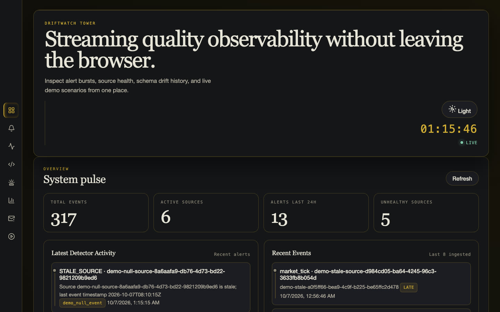

# DriftWatch Tower

Self-hosted event-quality monitoring for HTTP event streams and the official GitHub public-events API.

[](https://github.com/JeremyL691/DriftWatch-Tower/actions/workflows/ci.yml)
[](https://github.com/JeremyL691/DriftWatch-Tower/releases/latest)
[](LICENSE)

**[Download the latest release](https://github.com/JeremyL691/DriftWatch-Tower/releases/latest)** for the immutable image, deployment bundle, checksums, and manifest. Or follow the quick start below to build and run from source.



The preview uses generated demo events in an isolated acceptance stack; it is not a live service.

## What it does

DriftWatch evaluates event quality in Kafka Streams and stores source events, findings, incidents, and operational state in PostgreSQL. The dashboard shows collector health, alerts, incidents, dead letters, and live metrics.

- **Ingest safely:** broker-acknowledged HTTP ingestion with stable idempotency receipts.
- **Detect quality issues:** duplicate IDs and payloads, missing fields, null spikes, anomalies, late arrivals, range and format violations, and schema drift.
- **Recover visibly:** bounded retries, durable dead-letter records, replay, and explicit source-gap records.
- **Track the source:** a persistent GitHub collector with ETags, inbox identities, outbox state, and checkpoints.
- **Operate securely:** authenticated management and dashboard actions; ingestion uses a bearer token.


## Quick start

Requirements: Docker with Compose, 4 CPU cores and 8 GiB RAM recommended, and a free application port.

```bash
git clone https://github.com/JeremyL691/DriftWatch-Tower.git
cd DriftWatch-Tower
scripts/selfhost.sh init --env-file .execution/selfhost.env
scripts/selfhost.sh up --env-file .execution/selfhost.env
```

The source setup builds the local image. For a prebuilt install, download the deployment bundle from the [latest release](https://github.com/JeremyL691/DriftWatch-Tower/releases/latest) and set `DWT_APP_IMAGE` to the published image digest from its manifest.

When `curl -fsS http://127.0.0.1:18080/actuator/health/readiness` returns `{"status":"UP"}`, open [the dashboard](http://127.0.0.1:18080/dashboard) and sign in with the administrator credentials in `.execution/selfhost.env`.

Send a sample event with the ingest token from that file:

```bash
set -a
source .execution/selfhost.env
set +a
EVENT_ID="demo-$(uuidgen)"
EVENT_TIME="$(date -u +%Y-%m-%dT%H:%M:%SZ)"
curl --fail-with-body -X POST http://127.0.0.1:18080/api/v1/events \
  -H "Authorization: Bearer $DWT_INGEST_TOKEN" -H 'Content-Type: application/json' \
  -H "Idempotency-Key: $(uuidgen)" \
  -d "{\"event_id\":\"$EVENT_ID\",\"source\":\"demo\",\"event_type\":\"PaymentEvent\",\
       \"event_timestamp\":\"$EVENT_TIME\",\"payload\":{\"amount\":42.5,\"currency\":\"USD\"}}"
```

Retry with the same `Idempotency-Key` to receive the original ingestion identity without creating a second record.

## Source behavior

The default collector polls the official GitHub public-events API for `apache/kafka` every five minutes, respects the upstream poll interval and rate limits, and stores its checkpoint. The unauthenticated API budget is limited to 60 requests per hour.

This source is not realtime. The upstream API can delay or limit events, and its history is finite. DriftWatch records an explicit gap when history is unavailable instead of inventing a missing-event count. Events first seen at startup are marked `BOOTSTRAP`; later arrivals are evaluated as `LIVE`.

## Security and operations

- Only the diagnostic health endpoint is anonymous. Dashboard and management APIs require the administrator account; ingestion requires the bearer token.
- Kafka and PostgreSQL are not published on host ports. The app binds to `127.0.0.1` by default; put a TLS reverse proxy in front for remote access.
- Compose projects are namespaced. `scripts/selfhost.sh down` keeps data volumes; add `--volumes` only when you intend to remove that install's data.

```bash
scripts/selfhost.sh status  --env-file .execution/selfhost.env
scripts/selfhost.sh backup  --env-file .execution/selfhost.env --out backup/dwt.dump
scripts/selfhost.sh restore --env-file .execution/selfhost.env --dump backup/dwt.dump --target-db driftwatch_restore
```

## Verification

```bash
scripts/verify.sh preflight --out .execution/verify/preflight
scripts/verify.sh unit      --out .execution/verify/unit
scripts/verify.sh sca       --out .execution/verify/sca
```

The unit gate includes real Kafka and PostgreSQL container tests. Missing Docker or skipped container tests fail the gate instead of silently reducing coverage. GitHub Actions runs the complete project CI on pushes and pull requests.

## Project documents

- [Product and technical specification](docs/PROJECT_EXECUTION_GUIDE.md): product boundaries,
  data and API contracts, processing rules, and source behavior.
- [Runbook](docs/RUNBOOK.md): installation, upgrades, backup and restore, dead letters, retention, and troubleshooting.
- [Latest release notes](docs/RELEASE_NOTES.md): v1.0.2 artifacts, acceptance, and known limits.
- [Pinned runtime and dependency versions](docs/versions.md).
- [Architecture diagram](docs/assets/driftwatch-architecture.svg).

## Scope

DriftWatch is a single-node self-hosted inspection service with one Kafka broker and one PostgreSQL instance. The GitHub collector can be delayed, rate-limited, or unavailable; its status and recorded gaps are surfaced rather than presented as complete realtime delivery.

## License

[MIT](LICENSE)
