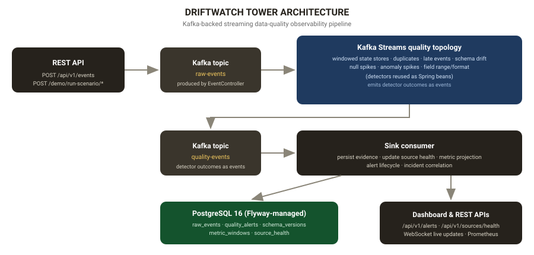

# DriftWatch Tower

A single-node data-quality inspection service built with Java 21, Spring Boot, Kafka Streams, and PostgreSQL.

[](https://github.com/JeremyL691/DriftWatch-Tower/actions/workflows/ci.yml)
[](LICENSE)

## Current status

The current implementation is a demo MVP. REST requests publish events to Kafka; a Kafka Streams topology inspects them; a sink stores raw events, alerts, and metric projections in PostgreSQL. The application also contains schema versioning, alert acknowledgement/resolution, source-health snapshots, Prometheus counters, and a static dashboard with WebSocket updates.

**The release refactor is specified, but has not been implemented.** GitHub collection, scheduled source-health monitoring, delivery idempotency, dead-letter recovery, and the complete release acceptance process are future work. Incident tables and APIs exist, but automatic grouping is not connected to the sink.

The 2026-09-30 audit ran the existing suites against real Kafka/PostgreSQL containers: 53 tests on local commit `8440013`, and 57 on remote commit `082fd84`, with no skips after environment compatibility adjustments. Additional boundary checks reproduced null-spike and anomaly-spike missed alerts in both versions. These counts describe those audited revisions, not a guarantee about a future checkout or release.

## Refactor handoff

- [Project execution guide](docs/PROJECT_EXECUTION_GUIDE.md): the single authoritative product, implementation, acceptance, and release specification.
- [Execution state](docs/EXECUTION_STATE.md): the first unfinished task, gate results, blockers, and recovery information.
- [Agent prompt](docs/AGENT_REFACTOR_PROMPT.md): copy the prompt into a new Agent session in goal mode.

The target is an open-source self-hosted release with continuous GitHub public-event collection, reliable quality evidence, recovery tools, and a 24-hour live-data acceptance run. This is the release target; the current checkout does not provide it yet.

## Current architecture



This diagram describes the audited implementation. Schema observation currently performs database reads/writes from the topology; the execution guide specifies how that boundary changes during the refactor.

## Running the current implementation

Requirements: JDK 21, Docker with Compose, and available Kafka/PostgreSQL services.

The existing Compose configuration uses `bitnami/kafka:3.7`. Both a manifest check and a direct pull returned `not found` during the 2026-09-30 audit. Consequently the current quick-start command below can fail on a machine without a cached image. Fixing and verifying this path is the P1 release gate.

```bash
docker compose --profile app up -d --build
curl --retry 30 --retry-connrefused --retry-delay 2 -fsS http://localhost:8080/actuator/health
curl -X POST http://localhost:8080/api/v1/demo/run-scenario/mixed-incident
```

Once the services are running, open [the local dashboard](http://localhost:8080/dashboard). Alternatively, start the application with `./mvnw spring-boot:run` against compatible Kafka and PostgreSQL instances configured through Spring environment variables.

## Tests and sample requests

```bash
./mvnw clean test --batch-mode
```

The suite includes detector/topology checks and Testcontainers integration tests. Container cases are currently skipped when Docker cannot be used. Inspect the actual skipped count; `BUILD SUCCESS` alone does not prove the integration path ran. The release refactor must make missing Docker or skipped integration tests fail the acceptance gate.

[Sample events](samples/events/README.md) are synthetic request examples. Their fixed timestamps are historical, so they can trigger late-event alerts today. They are not a live exchange or GitHub integration.

## Current limits

- Stateful spike detection has confirmed missed-alert cases; window handling does not yet provide the release contract.
- Duplicate checks are partition-local. The refactor defines and tests the source/event-type scope.
- Kafka delivery and database writes are not atomic; replay can repeat rows and metric increments.
- Source-health refresh depends on ingestion or API reads. Complete traffic silence does not independently trigger a scheduled check.
- Authentication, application-specific failure recovery, and the public-release installation check are not implemented.
- Browser rendering and sustained-load results must be measured during acceptance; no throughput claim is made here.

## License

[MIT](LICENSE)
