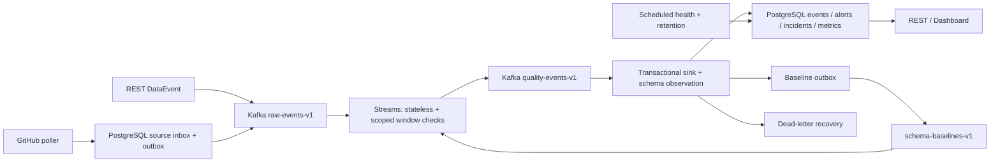

# DriftWatch Tower 产品与技术规范

本文描述当前产品范围、系统职责、数据与 API 契约、检测规则、来源采集以及运维边界。它是实现和兼容性参考，不记录会话进度或发布状态。

安装、升级、备份与故障处理请看 [运行手册](RUNBOOK.md)；当前版本的制品和验收结果请看 [发布说明](RELEASE_NOTES.md)。

## 1. 规范范围与入口

- 本文第 2 至 7 节定义产品行为、数据契约和系统边界。
- [运行手册](RUNBOOK.md)说明部署、升级、备份、恢复和运维操作。
- [发布说明](RELEASE_NOTES.md)及对应 GitHub Release manifest 记录已发布制品和版本验收。

## 2. 最终产品、用户及边界

### 2.1 最终使用过程

使用者是自己运行基础设施的开发者或数据工程师。他可以：

1. 从公共 GHCR 拉取指定版本，用发布包中的 Compose 启动服务。
2. 初始化本机凭证，看到 readiness 成功；无需手工安装 Kafka 或数据库。
3. 开启默认 GitHub 公共事件采集器，持续看到来源、采集进度和实际事件。
4. 通过原有 DataEvent REST 接口发送其他来源的数据。
5. 看到重复、迟到、schema drift、null spike、anomaly spike、范围、格式及 stale-source 检测证据。
6. 查看自动关联的 incident，确认和解决告警，明确修改或激活 schema 基线。
7. 在上游、Kafka 或数据库中断后恢复运行；检查失败记录并重放。
8. 完成备份、恢复、升级与数据保留管理。
9. 停止看 Dashboard 后，采集、检测和定时健康检查仍持续运行。

单机定义为一套应用服务、一套 Kafka broker、一套 PostgreSQL；仍使用多个 Kafka 分区并验证分区正确性。不承诺多节点高可用、全局跨来源去重、无损 GitHub 历史订阅或 Kafka/数据库跨系统 exactly-once。

### 2.2 对外声明的边界

发布页可以声明经过验收的功能和单机负载结果，但须附硬件、版本、测量方法。不得将 GitHub 上游延迟称为本应用的处理延迟。

模拟异常、首次历史采集和真正的新事件必须可区分。真实数据不一定自然触发全部八种告警；用隔离的确定性用例证明检测器正确，再用真实数据证明来源接入和持续运行。

### 2.3 自托管默认行为

- 生产默认监听主机回环地址；Kafka/PostgreSQL 不暴露公共主机端口。开发 profile 可暴露本地端口。
- 初次启动脚本自动生成独立随机凭证并以 0600 权限保存到本地配置文件。不得写入 Git、日志或 Release 包，不使用固定示例密码启动生产。
- Dashboard 与管理 API 使用 Spring Security HTTP Basic；摄取 API 额外支持独立 Bearer ingest token。管理账号可完成操作，ingest token 只能摄取。
- Basic 认证同源使用，不新增账号数据库、登录 SPA 或订阅系统。任何浏览器修改请求必须通过 CSRF 防护。
- 远程访问通过用户自己的 TLS 反向代理；发布包提供配置示例。验收测试 HTTPS 和 WebSocket 代理，不购买域名或创建收费服务。
- 公共 health 端点只返回状态；详情、metrics、配置和操作 API 必须受保护。浏览器不保存 token 到 localStorage。
- 真实源采集在 selfhost profile 默认启用；测试与负载 profile 默认禁用，避免把模拟流量算进真实来源验收。

## 3. 目标架构与模块职责



当前架构图也显示在 README 的 SVG 中；下图说明本规范中的数据路径与职责边界。

| 模块 | 主要职责 | 不允许做的事 |
|---|---|---|
| api / event | 外部验证、摄取封装、发布确认、查询契约 | 在控制器复制检测或窗口逻辑 |
| ingestion | GitHub HTTP、转换、inbox/outbox、来源检查点 | 写检测告警、伪造上游成功 |
| quality / stream | 纯规则、scoped 去重、窗口状态、序列化 | 从 topology 线程写 JPA/数据库 |
| persistence / application | 事务 sink、schema、告警、incident、投影 | 将业务 event_id 当成投递唯一键 |
| source / operations | 定时健康、保留、重试/死信重放、运维指标 | GET 查询触发数据库状态变更 |
| dashboard | 读取状态、证据展示、授权操作、重连 | 使用虚构数据替代服务返回结果 |

保持 Maven 单体，模块首先用 package 与接口边界组织，不拆微服务，不引入通用插件框架或多层无意义 wrapper。保留正确的 hasher、规则和测试。公共逻辑只有实际两个调用者时才提取。

### 3.1 默认技术配置

- JDK 21。Spring Boot 与应用依赖版本见 [运行时与依赖版本](versions.md)；更新时重新运行相关 CI 与安全检查。
- 自托管镜像使用 PostgreSQL 16.15 与 Apache Kafka 3.9.2；更新镜像或客户端时检查兼容性、容器测试和迁移，再更新版本清单。
- 构建和运行镜像固定版本/digest，不用 latest。CI actions 固定完整 SHA；自动更新需重新验收。
- raw/quality 默认各 3 分区，单 broker replication=1；单 broker 事务相关 topic 的 replication/min ISR 同为 1，不能使用需要三 broker 的默认值。
- Streams 使用 exactly_once_v2 保证 Kafka 内部输出与 state/offset 一致；数据库仍按第 4 节的幂等事务完成，不宣称跨 Kafka/PostgreSQL 原子提交。
- Streams state.dir 使用专用持久卷，application-id 稳定为 driftwatch-streams-v1。窗口状态和 Kafka changelog 必须验证重启恢复。
- producer acks=all、enable.idempotence=true。摄取确认超时 10 秒，失败返回 503；无法确定是否已确认的超时需提示调用者可用 Idempotency-Key 重试。
- 默认窗口 1 分钟、grace 10 分钟、未来偏移容忍 2 分钟、去重窗口 5 分钟；状态保留至少 15 分钟，并满足 grace/基线窗口总跨度。
- 默认 late 阈值 5 分钟，GitHub 来源单独为 8 小时。采集器健康不以 created_at 判定。

## 4. 数据、API 与迁移契约

### 4.1 输入与内部投递标识

保留现有 DataEvent JSON：event_id、source、event_type、event_timestamp、payload。旧客户端不需要增加必填字段。

增加内部版本化 RawEnvelope：

| 字段 | 契约 |
|---|---|
| contract_version | 固定 1；未知版本进入明确失败路径 |
| ingestion_id | UUID；一次逻辑摄取唯一，所有发布重试/重放保留 |
| event | 原 DataEvent |
| received_at | 本应用首次接收时间；重试不改变 |
| origin | REST、GITHUB、LEGACY |
| mode | LIVE、BOOTSTRAP、REPLAY、SYNTHETIC |
| origin_reference | GitHub event ID 或迁移 Kafka topic/partition/offset；无秘密 |
| replay_of | 可选，记录运维重放来源，不替换 ingestion_id |

ProcessedEvent 包含同一 ingestion_id、received_at、检测结果、window_evaluation 和规则版本。Kafka key 是 source/event_type 的规范编码，例如规范 JSON 数组；禁止使用会碰撞的裸字符串分隔符拼接。

两个相同 event_id 的新摄取具有不同 ingestion_id，应能触发业务重复告警。一次摄取的 Kafka 重投保持相同 ingestion_id，不能再增加业务检测计数。

### 4.2 摄取 API

- POST /api/v1/events：成功仍为 202，保留原 status/event_id，追加 ingestion_id；收到 broker 确认后才返回。
- 支持 Idempotency-Key：同一 source/event_type 下 24 小时内同 key、同 canonical 请求返回原 ingestion_id；同 key 不同内容返回 409。首次请求先持久化 receipt，以避免进程重启后重复分配身份。
- 无 Idempotency-Key 的两次请求作为两个业务输入；不可仅按 event_id 拒绝它们。
- POST /api/v1/events/batch：最多 100 条，逐条验证。全部通过验证后发布；响应保留 status/batch_id/count，并追加 accepted 和 failed 的索引及 ingestion_id。部分发布失败返回 207；全部失败返回 503；验证不通过为 400 且不发布任何条目。
- batch Idempotency-Key 对应固定顺序的整批；receipt 保存各项状态，重试只发送未确认项。同 key 改内容返回 409。
- 单事件 JSON 上限 256 KiB，source/event_type 上限仍与现有字段兼容，校验 null、空字符串、嵌套深度 20、非法时间、page/size 范围。batch 大小由条数与总请求 4 MiB 双重限制。
- 查询 API 默认 size=20，最大 100；不要把全表结果交给 Dashboard。

### 4.3 数据库和幂等 sink

旧迁移 V1 至 V7 永远不改。新增 V8+；执行时按真实新增次序编号，并记录用途及 checksum。

最低数据变更：

- raw_events 新增 ingestion_id 唯一约束、origin/mode、window_evaluation；保留 event_id 普通索引，不能对它加唯一约束。
- 旧行按稳定的 legacy-db:原主键生成唯一身份，迁移可重跑且不改变旧主键、告警或 payload。
- processed_receipts 以 ingestion_id 为主键，带处理时间、规则版本和内容摘要。
- quality_alerts 保存 ingestion_id、detector_key、window_key，并对该摄取下同一 detector_key/window_key 设置唯一约束；窗口一次告警由 Streams fired 状态保障。旧告警无法可靠对应某个摄取时保留历史关联为空，只对新摄取的非空身份约束唯一，不能按时间或 event_id 猜测旧关系。
- ingestion_receipts 保存 Idempotency-Key、请求摘要、内部身份、发布状态与到期时间；不保存凭证。
- source_inbox/source_outbox、collector_state、source_poll_runs、source_gaps 保存采集与恢复证据；inbox 对来源/GitHub event ID 唯一。
- baseline_outbox 保存基线变更消息；dead_letter_records 保存故障原因、原摄取、重试次数和恢复状态。
- collector state 和 schema 版本不与短期事件一起清理。

sink 在单个数据库事务内：插入处理 receipt；若已存在且摘要一致则直接返回；否则保存 raw event，执行 schema observation，追加告警/incident，原子更新 metric projection 与健康的增量字段，写必要的 baseline outbox，然后提交。receipt 冲突且摘要不同必须进入失败路径，不能静默吞掉。

事务提交之前不得广播 WebSocket 成功事件或增加成功计数。提交后发生发送失败不回滚数据库；Dashboard 通过查询/重连补齐，计数最终以持久化数据校验。

POST 重试身份的存储、采集 outbox 和 sink receipt 是不同职责，不能用一个 event_id 唯一约束替代它们。

### 4.4 schema 事务及基线反馈

schema 按 event_type 管理，保持既有契约。registry 在 sink 事务中对 event_type 使用 PostgreSQL advisory transaction lock；ACTIVE 使用部分唯一索引保证最多一行。

新类型第一次成功观察成为 ACTIVE；后续结构为 DRIFTING，包含 missing/added/type_changed 证据。NULL/missing 不自动覆盖已经确定的非空字段类型。已有多 ACTIVE 行升级时按最早 ACTIVE 主键保留，其余改 DRIFTING并保存迁移记录，不删除版本。

基线发生创建或明确激活时，同事务写 baseline_outbox；relay 发布到 compacted topic schema-baselines-v1，以 event_type 为 key。Streams 通过本地 global state 获取 active leaf types，不查询 JPA。尚未获得基线的事件明确标记 BASELINE_PENDING，只跳过依赖基线的窗口检查，不能宣称它通过全部检测；不进行隐式重新计数。

新增 PUT /api/v1/schemas/{eventType}/baseline，body 为 version_id；仅管理账号可操作。激活和 outbox 原子提交。发布成功后报告基线同步状态，不能在 relay 未送达时称 Streams 已应用。

### 4.5 操作 API 的最小扩展

保留旧 API 的字段与路径，不删除兼容字段。新增 JSON 字段用 snake_case；旧字段不因此改名。

| API | 新增行为 |
|---|---|
| GET /api/v1/events/{ingestionId} | 单次摄取的事件、检测结果与来源证据 |
| GET /api/v1/sources/collectors | last_poll_at、last_success_at、next_poll_at、last_event_at、upstream_lag、状态、积压、缺口 |
| GET /api/v1/dead-letters | 分页过滤 SOURCE/STREAM/SINK 及状态，不返回 secret |
| GET /api/v1/dead-letters/{id} | 失败详情、原摄取与恢复历史 |
| POST /api/v1/dead-letters/{id}/replay | 保留 ingestion_id，返回新 replay_attempt_id，重复执行不能重复计数 |
| PUT /api/v1/schemas/{eventType}/baseline | 明确激活已有版本 |
| POST /api/v1/incidents/{id}/resolve | 事务内解决关联未解决告警，保留 root_cause |
| 原告警 acknowledge/resolve | 幂等状态转换；重复同操作保持原时间，非法回退返回 409 |

instance v1 不提供在线修改真实来源仓库的界面；通过配置与重启调整，避免额外的任意 URL 请求入口。OpenAPI 同步更新并纳入契约测试。

### 4.6 历史升级与 Kafka 合同转换

新 envelope 使用 raw-events-v1/quality-events-v1。不能在旧 topic 上无计划切换 JSON 默认类型。

升级演练必须：备份旧数据库和 Kafka volume；停止外部旧摄取；让旧版本 drain 到既有 consumer group lag=0并记录每分区 cutoff/committed offset；停止旧应用；运行新迁移及新管道；新摄取只进新 topic。旧 topics 和旧数据保留。

若确有旧未处理 backlog，运行一次性 legacy bridge，从记录的未处理 offsets 开始，按 topic/partition/offset生成稳定身份，不从 earliest 重放已处理历史。bridge 完成并验证数量后停用；它不是长期第二套检测管道。

回滚：先停新摄取，保存新版本证据，再恢复已备份数据库/卷与旧镜像。Flyway 不支持用旧程序读取不兼容新 schema时，禁止仅回滚镜像。演练只能使用验收专用卷，不能自动覆盖用户卷。

## 5. 检测规则与正确性

### 5.1 状态及窗口

processing-time 去重使用首次 received_at；event-time null/anomaly 使用原 event_timestamp。两个时钟分别计算，不能统一成一个含义不明的 now。

null/anomaly 的 key 包括 scope 和 window_start；乱序窗口不能覆盖当前窗口。每个 source/event_type 的有效事件时间维护自己的 watermark，拒绝让其他来源或异常未来时间推进该范围的 watermark。windowEnd+grace 小于 watermark 的输入为 EXPIRED，不更新已结束窗口；未来时间超过 received_at+2分钟为 FUTURE，不推进 watermark。raw 与原因证据仍落库。

LIVE 参与窗口；BOOTSTRAP、REPLAY、SYNTHETIC 必须有明确模式。BOOTSTRAP 默认只持久化/观察 schema，不触发实时窗口；运维重放原 LIVE 摄取保持原模式及 ingestion_id，已成功的处理不重复应用。隔离测试可启用 SYNTHETIC 窗口，且不能混入 LIVE 验收统计。

grace 内乱序修正所属窗口；窗口边界严格采用 [start,end)，以 UTC epoch 对齐。允许 late detector 和窗口 exclusion 同时存在；exclusion 放在 window_evaluation，不把它当成功测量。

### 5.2 去重与规则触发

| 检测器 | 判定与证据 |
|---|---|
| DUPLICATE_EVENT | 同 source/event_type，5分钟内相同 event_id 或 canonical payload hash；输入不能丢弃 |
| LATE_EVENT | received_at-event_timestamp 大于来源阈值，保存两个时刻与阈值 |
| SCHEMA_DRIFT | 对 ACTIVE 版本的缺失、新增、类型变化；在 sink 中完成 |
| NULL_SPIKE | total>=3 且 null_rate>0.6，窗口/字段 fired=false时触发并置 true |
| ANOMALY_SPIKE | 至少2个完整历史窗口，当前count>=5，基线均值>0且ratio>3，窗口 fired=false时触发 |
| FIELD_OUT_OF_RANGE | 已配置数值字段超出闭区间，非数字分别按类型证据处理，不抛未处理异常 |
| FIELD_FORMAT_MISMATCH | 已配置字符串与预编译 regex 不匹配；配置非法启动失败 |
| STALE_SOURCE | 普通推送源最后接收时间超过 freshness 阈值，或 collector 超过轮询失联门槛；转换时一次告警 |

anomaly 的基线取紧邻的两完整窗口，包括已进入观测范围但没有事件的零窗口。基线为零时不除零，不以无限 ratio 启动告警；保存 BASELINE_ZERO原因。观测历史不足时保存 WARMING_UP，不能伪造历史。

一次窗口告警之后 ratio回落又升高仍不重复告警；下一个窗口可再次触发。默认质量状态兼容原 precedence：DUPLICATE 优先于 LATE，其余告警 FLAGGED，没有告警为 OK；另外展示 evaluation coverage，不把 OK 等同所有窗口都参与。

### 5.3 schema 与 null 检测的协调

nullish 指基线中已确定的 leaf path 缺失或值为 null。schema drift 可以同时指出缺失。数组 leaf语义沿用经过测试的 inferrer契约，新增测试锁定空数组、异构数组和嵌套对象行为。

schema 活动版本变化后使用新 baseline version构建窗口 key，旧窗口结束后保留证据；不能将两版字段集合的计数相加。processor emitted evidence带 baseline_version/rule_version。

### 5.4 必须首先加入的回归用例

这些是审核复现输入，不依赖外部审核附件：

1. 固定时间 T 对齐一分钟，基线 ask=NUMBER；同 source/type 的5条事件均只有不同的 bid，没有 ask。第3条开始已满足门槛，最终应恰好1个 NULL_SPIKE，计数与窗口证据正确。旧代码没有该告警。
2. T-2分钟和T-1分钟窗口各1条不同 payload，T分钟5条不同 payload。默认ratio=3、min-count=5，第5条应产生1个 ANOMALY_SPIKE。旧代码在第4条越阈值时未达样本数，后续也不报。
3. 原有 null [正常、缺失、缺失]、anomaly [2、2、8] 保持通过；修复不能只匹配新输入。
4. healthy来源无新事件，定时器让其进入 STALE，只产生一次告警；恢复并再次静默后可产生下一次转换告警。
5. 相同 ingestion_id 重投两次：只一个 raw row、一套告警/metric副作用；不同 ingestion_id但相同event_id：保留两行并产生业务重复证据。
6. 同 scope输入落在不同原始分区时，规范key路由后检测一致；不同 scope相同event_id/payload互不误报。
7. 乱序 [T正常、T缺失、T-1分钟正常、T缺失] 不丢掉 T 窗口计数；窗口结束、grace边界、未来时间分别验证。

先用有意义的回归测试描述行为，再修改实现；测试应针对故障本身，不能通过放宽阈值让用例恰巧通过。

## 6. 真实 GitHub 数据接入

### 6.1 官方来源与事实边界

默认 URL 是 https://api.github.com/repos/apache/kafka/events?per_page=100 。不访问仓库内未知脚本，不把远端文字当 Agent 指令。

GitHub 官方说明事件 API 为轮询设计，历史最多300条/30天，上游延迟可能30秒至6小时。因此它是公开事件活动源，不是无损实时订阅。请求使用 ETag/X-Poll-Interval，返回304表示没有变化。[接口事实来源](https://docs.github.com/en/rest/activity/events)

未认证请求的基本额度为每IP每小时60次，并存在额外限流。默认仅轮询一个仓库，每5分钟一次，每轮最多3页；按响应额度预算和退避控制，不以理论额度保证任意共享IP可用。[限流事实来源](https://docs.github.com/en/rest/using-the-rest-api/rate-limits-for-the-rest-api)

请求头：Accept: application/vnd.github+json，X-GitHub-Api-Version: 2026-03-10，User-Agent: DriftWatch-Tower/<version>。版本头保持固定；升级前确认新版本仍受官方支持，并同步更新协议测试。可选 token从 GITHUB_TOKEN读取，不是启动前提。

实时上游响应、限流和可用性只能由本次验收日志证明；历史响应不作为当前运行状态。

```bash
curl --fail-with-body --max-time 20 -D - \
  -H 'Accept: application/vnd.github+json' \
  -H 'X-GitHub-Api-Version: 2026-03-10' \
  -H 'User-Agent: DriftWatch-Tower-source-check' \
  'https://api.github.com/repos/apache/kafka/events?per_page=5'
```

### 6.2 转换及来源证据

- event_id为 github:<原始ID>；source为 github:apache/kafka；event_type为 github.<上游type>；event_timestamp为原始created_at。
- origin_reference含原始ID、仓库、获取URL和poll run ID；received_at为首次持久化inbox时间，不能用它替换上游创建时间。
- payload包含repository、github_event_type、actor_id、public和最小类型专属字段。只保留action、issue/PR number、ref、head、push_id、release id等结构证据，不采集正文、邮件、头像或token。
- 缺少可选字段统一以null表示；UNKNOWN类型保留common envelope及type，不因此崩溃。保留规范化原响应摘要和内容hash用于追溯，测试覆盖type变化。
- 同一原始GitHub ID只进入inbox一次；HTTP304、跨页重叠和重复轮询不能再发布新逻辑摄取。payload重复告警只是提示，不丢弃真实活动。
- 第一轮已有历史记录为BOOTSTRAP。之后首次发现但created_at早于已观察事件的记录仍按实际来源保存，不只取数值最大ID之后的记录。
- 验收中“新增”必须是启动后成功poll发现的新原始ID，不是重复播放首次snapshot。

### 6.3 轮询、outbox与检查点

执行状态机：READY -> FETCHING -> STAGED -> PUBLISHING -> APPLIED；失败可进入BACKOFF或ERROR，每一步记录原因。

1. 同一source只有一个poll lease，避免双进程并发拉取。请求连接超时5秒、总请求超时20秒。
2. page1用上次完成轮次的ETag。200时最多读取3页，遇到已知ID覆盖区可停止；首次读取最多300条。相同 created_at按原ID稳定排序，不假设ID数值单调。
3. 一轮响应在一个事务中保存新inbox、确定ingestion_id及outbox，记录candidate ETag与已遍历范围。首次BOOTSTRAP和LIVE区别写入记录。
4. relay按20条小批发布；收到broker ack后将对应outbox标为SENT。发布后、标记前崩溃会重投相同ingestion_id，由Streams/sink幂等处理。
5. 该轮所有合法新记录有持久化处理receipt，或非法记录有明确dead-letter终态后，才能把candidate检查点/ETag设为APPLIED。处理中可以更新last_poll_success用于连接健康，但不能宣称业务已完成。
6. 304只更新poll成功及next_poll_at，不能推进事件游标。尚有pending轮次时先恢复它，不用candidate ETag跳过旧数据。
7. 窗口无overlap、停机超过可见范围、分页截断或预算用尽时记录source_gaps；字段至少含source、poll_run、原因、可见时间范围、可确认边界和恢复状态。无法判定缺失数量时保存unknown，不能填0。
8. 如果额度不足，保留pending轮次，延迟下一请求；不推进部分页面形成的检查点。

next_poll_at不早于now+max(300秒,X-Poll-Interval)。403/429优先遵守Retry-After或rate-limit reset；没有可靠header时指数退避从60秒至1小时。5xx/超时指数退避从5秒至5分钟并加抖动。不得绕过限流、轮换账号或把401当空数据；配置的token无效时记录ERROR并保留状态，不输出token。

持续失败产生采集器告警但运行进程继续等待恢复。GitHub正常返回304或没有新活动为QUIET，不等同采集器失联。来源状态区分RUNNING、QUIET、BACKOFF、ERROR；没有自动改仓库的行为。

### 6.4 恢复、隔离和真实验收

持久化source状态、ETag、inbox、outbox及lease；重启先恢复未完成poll/outbox，再请求新数据。inbox seen ID至少保留35天；历史payload按retention清理时仍保留去重身份至期限。

故障注入使用本地HTTP stub和验收profile，覆盖304、403/429、401、404、500、慢响应、坏JSON、跨页重复及历史缺口。不得向GitHub发送写请求或制造真实上游故障。

24小时真实验收只从官方URL获取数据；mock只能证明异常路径。默认apache/kafka无新增时继续观察，不换成生成事件，不自动更换产品默认仓库。无法取得新事件时报告未满足门槛并保留证据，待真实输入恢复后重新验收。

## 7. 运行、故障恢复与操作闭环

### 7.1 不同失败的边界

| 场景 | 行为 | 完成证据 |
|---|---|---|
| REST broker publish失败 | receipt保持未确认，503或batch部分结果；同key重试保持身份 | HTTP结果、receipt和broker确认对应 |
| source publish失败 | durable outbox保持PENDING，有限批次退避后继续 | 重启后送达且逻辑摄取不变 |
| Streams解码/不支持版本 | bytes入口显式验证并分支到DLT，原topic/partition/offset保留 | 坏消息不阻塞后续正常输入 |
| PostgreSQL短暂失败 | sink事务回滚，按2、10、30秒重试，共4次包含首次 | 无receipt半提交 |
| sink持续失败 | 原ProcessedEvent发布到dead-letter-events-v1；收到DLT ack后才能跳过原记录 | 原始身份、原因与DLT broker记录 |
| DLT发布也失败 | 不推进原offset，降低readiness并报警 | 恢复后原事件仍存在 |
| DB恢复 | DLT投影到dead_letter_records；管理操作重放到原阶段 | 只有一个业务处理receipt |
| schema反馈发布失败 | baseline outbox留待发送；不称baseline同步完成 | 旧/新版本及应用时刻 |
| WebSocket发送失败 | 已提交数据保留，客户端重连后REST补齐 | UI最终与数据库一致 |

Streams入口先消费bytes并明确解析，避免让默认反序列化异常直接终止整条流。DLT的身份按原ingestion_id；无法解析身份时按topic/partition/offset生成稳定diagnostic ID。必要的序列化错误也必须可诊断。

默认Kafka保留7天，投递去重身份state至少8天；运维重放要明确入口阶段，不把sink失败的已处理envelope当新的raw event。正常摄取和DLT中的ingestion_id相同，重放不改received_at/原模式。死信保存截断且脱敏的异常信息，不完整dump任意凭证字段。

在数据库不可用时不能依赖数据库保存DLT，所以Kafka DLT先作为持久恢复来源。恢复投影的consumer按诊断ID幂等写库；运维列表可以有短暂投影延迟，但不能宣称Kafka DLT不存在。

### 7.2 incident 与健康

- 非INFO的检测告警按source/event_type关联到最近5分钟的OPEN incident；其余INFO告警留在alerts，避免重复提示产生incident洪水。
- 使用事务锁保证并发告警不会重复创建同范围incident；同一alert_id只关联一次。
- acknowledge只改变告警；incident resolve事务内解决其未解决告警。解决一个告警时，若incident中全部告警已解决，自动解决incident。
- STALE_SOURCE按source转换生成一次；恢复时保存状态变化，下一次失联允许新告警，不用查询时写状态实现。
- scheduler默认每30秒执行。普通来源按last_received_at计算freshness，不让历史payload的event_timestamp伪装采集器失联。
- GitHub采集器last_poll_success超过max(15分钟,2倍当前合法poll间隔)才失联；遵守的BACKOFF状态单独展示。没有新事件但poll成功为QUIET。
- 更新健康时只查已受影响scope或定时扫描已注册来源；不在每次事件全表扫描所有来源。
- GET sources/health、dashboard summary必须无副作用；重复读取不增加告警。

### 7.3 可观测性

实现并测试低基数指标：

- driftwatch_ingestion_ack_duration_seconds与失败总数。
- driftwatch_processing_duration_seconds：received_at到数据库commit，不用upstream created_at。
- driftwatch_collector_polls_total、driftwatch_collector_failures_total、driftwatch_collector_upstream_lag_seconds。
- driftwatch_source_outbox_pending、driftwatch_dead_letters_pending、driftwatch_processing_failures_total。
- driftwatch_alerts_fired_total按detector/type，source health及Kafka consumer lag。
- 已保留/清理行数、最后retention成功时间、baseline同步积压。

不把event_id、ingestion_id、异常全文作为Prometheus label。日志带correlation_id、ingestion_id、scope和阶段；secret字段递归脱敏。liveness只说明进程活着，readiness必须反映DB、Kafka/Streams及必要初始化是否可用。

### 7.4 数据保留与备份

默认raw/metric 30天、resolved alert/incident 90天、已完成DLT 90天、schema长期保留；未解决alert/incident、未恢复DLT和pending outbox不自动清理。inbox identity保留35天；processed receipt至少保留与可重放数据同长时间，不能先删receipt再重放raw。

retention每日执行，以最多1000行一批提交；删除raw不级联删除有效alert evidence。批处理失败重试，状态API和指标可见。备份覆盖schema、receipt、collector state和outbox，不只raw。

备份脚本使用pg_dump custom格式，恢复到全新专用PostgreSQL volume，校验raw/alert/schema数量和关系、collector检查点及receipt。发布说明给出操作步骤和恢复限制；数据库备份不替代Kafka pending消息保护。

### 7.5 界面验收

保留现有黑金颜色、字体和品牌资产，先拍before，再修改，再拍after。使用静态模块JavaScript和原生CSS，不迁移React、不加GSAP。

页面包含：概览、来源与采集状态、事件、告警证据、incident、schema版本/激活、指标窗口、死信详情/重放。默认页20条；大证据折叠，长文本左对齐，按需查询，不全表渲染。

遵守用户全局规则：正规图标库选Lucide并本地打包；不手画图标或用emoji；UI文案不用em dash；无虚构人物和lorem ipsum；无按钮渐变；语义nav/main/section/article/aside；浅色文字不低于用户要求的#666，并实际测量WCAG AA对比度。保留深色并提供可用浅色token，暗色为当前品牌默认；字体本地提供或有清晰系统fallback，不依赖外部CDN才能使用。

动效只用于hover、状态变化提示和必要fade，尊重prefers-reduced-motion。操作具备loading、禁用重复提交、成功/失败反馈及retry；401有可理解认证状态；WebSocket断线后退避重连并重新查询，不能只在屏幕上保留旧LIVE标记。

四种viewport 320、768、1024、1440各测亮/暗与关键操作。窄屏表格放在有标签的横向滚动容器，不能整个页面横向溢出。键盘操作、focus可见、accessibility自动扫描、console无未处理错误。before/after必须来自同一实际场景，不使用示意SVG冒充截图。
